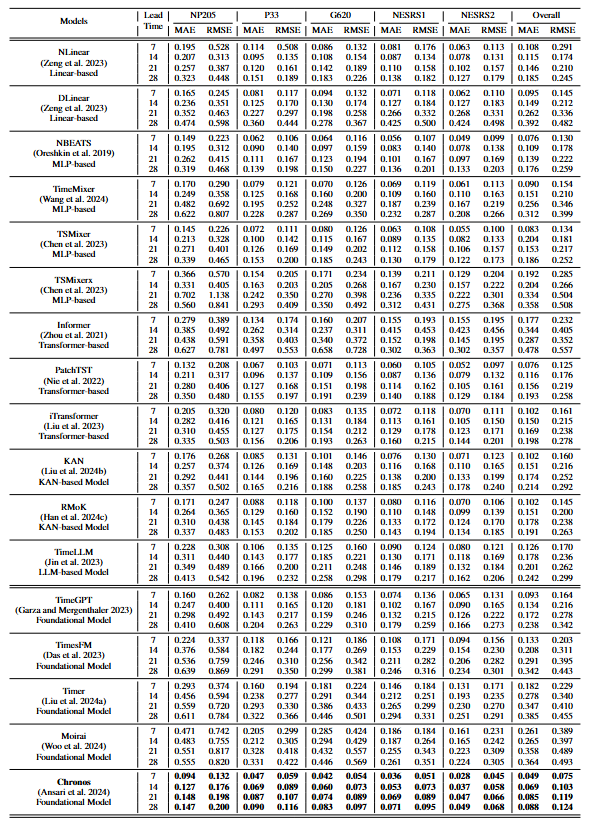

# Everglades-Benchmark
In this study, we investigate twelve task-specific models and five time series foundation models across six categories for a real-world application focused on water level prediction in the Everglades.

Here's an overview of our framework for water level forecasting.


## Installation

1. Create & activate your Python environment:
    - `conda create -n ENV_NAME python=3.10`
    - `conda activate ENV_NAME`

2. Install dependencies:
    - `pip install -r requirements.txt`

3. Verify your setup:
    - `python --version`  # should show Python 3.10.x
    - `pip list`          # confirm key packages are installed

## Directory Tree
```text
Everglades-Benchmark/                - this repository root
├── README.md                       
├── requirements.txt                - pinned Python dependencies
├── data/                           - input & result files
│   ├── final_concatenated_data.csv  - raw & processed time-series data
│   └── Results-28days-final.xlsx    - results of all models
├── task-specific-models/           - task-specific forecasting models
│   ├── Everglades-Informer-28days.ipynb
│   └── Everglades-TaskSpecific-Models28days.ipynb
├── foundation-models/              - pre-trained time series foundation models
│   ├── Everglades-Chronos-28days.ipynb
│   ├── Everglades-Moirai-28days.ipynb
│   ├── Everglades-TimeGPT-28days.ipynb
│   ├── Everglades-TimeLLM-28days.ipynb
│   ├── Everglades-Timer-28days.ipynb
│   └── Everglades-TimesFM-28days.ipynb
├── extreme-case-evaluation/        - SEDI metrics
│   └── Everglades-SEDI-Metrics.ipynb
├── Visualizations/                 - analysis & plotting notebooks
│   ├── Everglades-Station-Variables-Analysis.ipynb
│   ├── Everglades-ParameterStudy-Viz.ipynb
│   ├── Everglades-Data-Visualizations-ActualvsPred.ipynb
│   └── Everglades-Inference-Time-Visualization.ipynb
│
├── Web_Demo_Application/                 - Interactive Web Demo Application Folder
│   ├── Demo.png                           - Application GUI Visual
│   ├── Demo2.png                          - Application GUI Visual
│   ├── app_chronos_autogluon.py           - Chronos-Bolt Streamlit app
│   └── app_neuralforecast_everglades.py   - Multi-Model Benchmarks Streamlit app
│
└── figure/                    - static framework image and results table for README
    ├── Framework-Visual.jpeg
    └── Everglades-Table-Results.png
```
## Usage

Launch Jupyter and run the notebooks:

- Task-specific models
    - Trains and evaluates Informer and other classical architectures. Run the ipynb files under the task-specific-models folder to reproduce the experiment results.

- Foundation models
    - Run the ipynb files under the foundation-models folder to reproduce the experiment results.

- Extreme-case evaluation
    - Run the ipynb file under the extreme-case-evaluation folder to compute the Symmetric Extremal Dependence Index for each method.

- Visualizations
    - Station-variable correlations: Visualizations/Everglades-Station-Variables-Analysis.ipynb
    - Parameter study plots: Visualizations/Everglades-ParameterStudy-Viz.ipynb
    - Actual vs. predicted time-series: Visualizations/Everglades-Data-Visualizations-ActualvsPred.ipynb
    - Inference time comparison: Visualizations/Everglades-Inference-Time-Visualization.ipynb

## Web Demo Usage

The `Web_Demo_Application/` folder contains two interactive Streamlit applications:

- **app_chronos_autogluon.py** → Chronos-Bolt forecasting demo  
- **app_neuralforecast_everglades.py** → Task-specific models benchmark demo  

To run either applications:

1. **Navigate into the project folder**  
   `cd Everglades-Benchmark/Web_Demo_Application`

2. **Install the required environment**  
For the NeuralForecast demo:
  - `pip install -r ../requirements.txt`  
For the Chronos-Bolt demo (requires separate env):
  - `pip install -r requirements_chronos.txt`

3. Launch Streamlit

- `streamlit run app_chronos_autogluon.py`  
or
- `streamlit run app_neuralforecast_everglades.py`

## Results
The table below shows how each model performs across 5 stations (NP205, P33, G620, NESRS1, NESRS2) for lead times of 7, 14, 21, and 28 days. The first 12 models are task-specific, while the last 5 are pre-trained foundation models for time series. The best results are in bold.

<p align="center">
  
</p>
