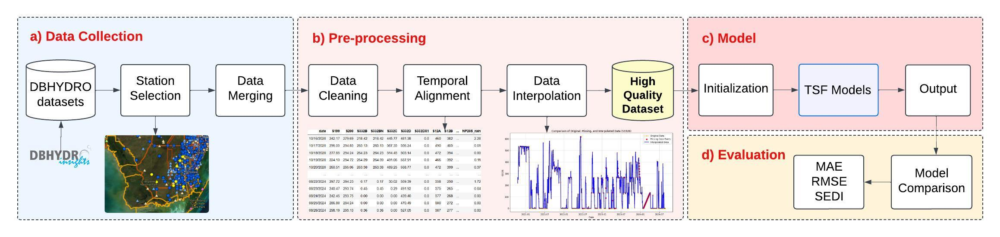

# Everglades-Benchmark
In this study, we investigate twelve task-specific models and five time series foundation models across six categories for a real-world application focused on water level prediction in the Everglades.

Here's an overview of our framework for water level forecasting.

## Installation

1. Create & activate your Python environment:
    - `conda create -n ENV_NAME python=3.10`
    - `conda activate ENV_NAME`

2. Install dependencies:
    - `pip install -r requirements.txt`

3. Verify your setup:
    - `python --version`  # should show Python 3.10.x
    - `pip list`          # confirm key packages are installed
